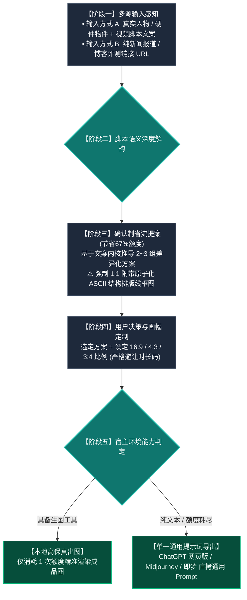

#  Video Cover Designer (视频封面设计引擎)

这是一个为 Antigravity / Claude Code / Cursor / Agent 生态打造的**科技数码品类、高点击率视频封面生成 Skill**。

---

## 🚦 一、 核心铁律：脚本语义第一性原理（反教条模板套用）

```
【用户的脚本文案】是灵魂 ➡️ 100% 决定封面的情绪基调、核心冲突与道具形态；
【真实视觉标准体系】是外衣 ➡️ 仅提供 85mm 零畸变人像、-4.0° 重工立体字排版、高饱和黄白配色与严谨构图。
```

### 🚫 严禁教条生搬硬套（Anti-Pattern Checklist）
- ❌ **非避坑/非欺诈文案**：严禁出现“别被骗了！”、“虚假宣传”印章或黑黄警戒胶带；
- ❌ **非两品对比文案**：严禁强行塞入“VS”爆破标或双雄对峙；
- ❌ **非物理拆解文案**：严禁强行贴上“拆！”字印章。

---

## 🗺️ 全链路执行流程图



---

## 🌟 真正的通用视觉不变量（Aesthetic Invariants）

- **零镜头畸变与真实手势体系**：
  - 杜绝鱼眼与大头，严格采用 **50mm~85mm 标准单反人像镜头（1:1 真实骨骼比例）**；
  - 真实适配托举展示、双向指点、托腮凝视、笔记本实物互动等经典肢体交互。
- **重工立体字与色彩体系**：
  - 主标题逆时针 `-3.0° ~ -5.0°` 动感微倾角；
  - 纯黑粗描边 + 纯黑硬实 3D 立体实底投影；
  - 纯白主字 `#FFFFFF` 搭配核心微机高光黄底衬 `#F8C039` / `#FED700`。
- **16:9 / 4:3 / 3:4 三比例精准重构**：
  - **16:9**（横屏左右分栏避让时长码）；
  - **4:3**（向中心微缩收拢）；
  - **3:4**（标题自动拆为 3 行垂直堆叠，底部贯穿核心参数栏，画面全屏饱满无黑边）。
- **方案线框原子契约**：提几个方案就必须强制绑定输出几个专属 ASCII 结构排版线框图，严禁任何方案省略。
- **单一全通用提示词导出**：纯文本 Agent 下自动输出纯自然语言通用 Prompt，直接兼容**网页版 ChatGPT、Gemini、Midjourney、即梦、可灵**。

---

## 📂 安装方法
只需将本目录下的 `SKILL.md` 复制到任何支持 Agent Skills 的目录（如 `~/.gemini/config/skills/` 或 `~/.claude/skills/` 或 `~/.agents/skills/`），即可在任意用户的环境中开箱即用！
