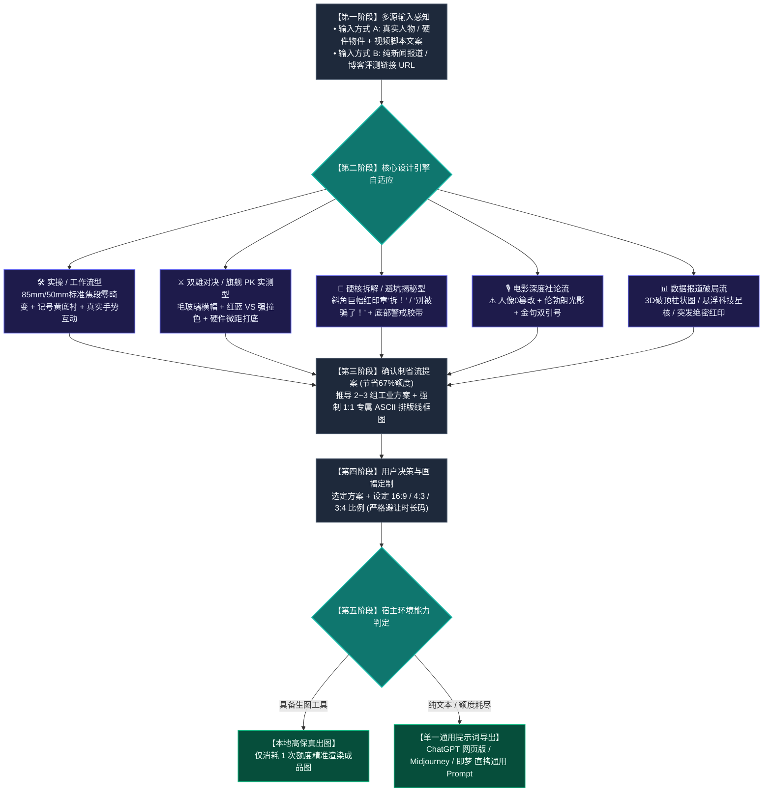

#  Video Cover Designer (视频封面设计引擎)

这是一个为 Antigravity / Claude Code / Cursor / Agent 生态打造的**科技数码品类、高点击率视频封面生成 Skill**。

---

## 🗺️ 全链路执行流程图

---

## 🌟 核心特性速览（基于 30 套原图工程解码）

- **零镜头畸变与真实手势体系**：
  - 杜绝鱼眼与大头，严格采用 **50mm~85mm 标准单反人像镜头（1:1 真实骨骼比例）**；
  - 深度适配托举展示、双向对决指点、托腮凝视、拒斥 T 姿、笔记本实物互动等 5 大经典手势。
- **重工立体字与色彩体系**：
  - 主标题逆时针 `-3.0° ~ -5.0°` 动感微倾角；
  - 纯黑粗描边 + 纯黑硬实 3D 立体实底投影；
  - 避坑类（纯白 + 明黄 `#FED700` + 警示红 `#ED1C24`）、对决类（极光青蓝 `#00D2FF` vs 霓虹品紫 `#A855F7`）。
- **标志性视觉资产**：
  - 撕裂水彩“VS”对决印章、悬浮品牌全息晶卡、黑黄警示斑马胶带、斜角红方印章。
- **16:9 / 4:3 / 3:4 三比例精准重构**：
  - **16:9**（横屏左右分栏避让时长码）；
  - **4:3**（向中心微缩收拢）；
  - **3:4**（标题自动拆为 3 行垂直堆叠，底部贯穿警戒胶带，画面饱满无黑边）。
- **确认制省流工作流**：前置输出 2~3 个带线框图的创意方案，待用户选定后精准单次出图，**节省 67% 生图配额**。
- **方案线框原子契约**：提几个方案就必须强制绑定输出几个专属 ASCII 结构排版线框图，严禁任何方案省略。
- **单一全通用提示词导出**：纯文本 Agent 下自动输出纯自然语言通用 Prompt，直接兼容**网页版 ChatGPT、Gemini、Midjourney、即梦、可灵**。

---

## 📂 安装方法
只需将本目录下的 `SKILL.md` 复制到任何支持 Agent Skills 的目录（如 `~/.gemini/config/skills/` 或 `~/.claude/skills/` 或 `~/.agents/skills/`），即可在任意用户的环境中开箱即用！
