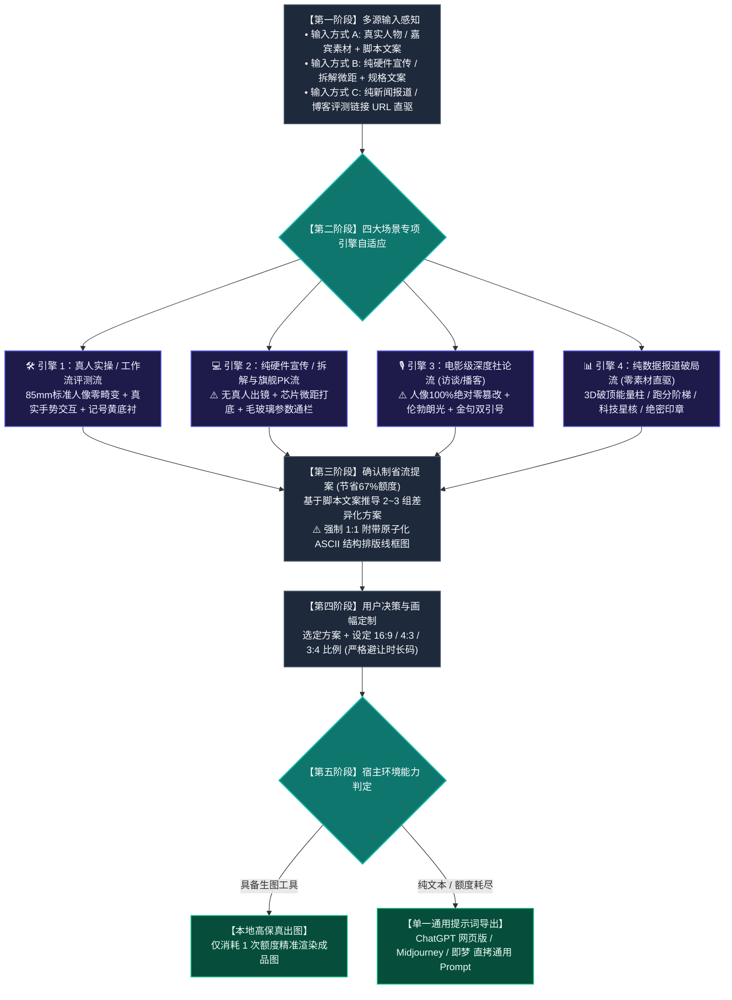

# 🎬 Video Cover Designer (科技数码视频封面设计引擎)

这是一个为 Antigravity / Claude Code / Cursor / Agent 生态打造的**科技数码品类、高点击率视频封面生成 Skill**。

---

## 🎨 一、 核心设计哲学：品牌视觉统一性 × 场景自适应 × 脚本语义有机衍生

核心目标：**让观众在信息流中一眼就能认出是同一频道的专业高品质封面（统一视觉调性），同时精准自适应纯硬件、深度访谈、真人实操、纯数据等四大业务场景，并完全根植于具体脚本文案进行有机创新（杜绝套死模板与机械照搬）。**

```
【统一的视觉语法体系】 ➡️ 确立频道辨识度（一眼认出是同一种工业级爆款画风）
        ✖️
【四大场景专项引擎】   ➡️ 针对纯硬件、访谈播客、真人实操、纯数据自适应路由
        ✖️
【具体文案的有机创新】 ➡️ 赋予每期封面独特的灵魂与戏剧张力（拒绝照搬往期贴纸）
```

- **统一视觉语法（保持频道一致调性）**：
  - **摄影质感**：85mm 标准单反人像中焦 / 100mm 工业微距平视，1:1 真实人体与硬件比例，**彻底杜绝大头鱼眼畸变**；
  - **排版形态**：经典双行结构，字体整体逆时针 **`-3.0° ~ -5.0°` 动感微倾角**；
  - **重工字效**：字芯 + 纯黑极粗描边 + 向右下方硬朗延伸的 **纯黑 3D 硬实立体投影**；
  - **标志色彩**：纯白主字 `#FFFFFF` 搭配高饱和微机明黄 `#F8C039` / `#FED700`；
  - **安全构图**：右下角 20% 空间严格留白，彻底避让播放器时长码。
- **有机文案创新（拒绝机械照搬）**：
  - **印章是情绪放大器**：根据文案定制词汇（防骗写【别被骗了！】，冷门写【宝藏】，实测写【首测】，做工写【拆！】，专访写【深度对话】）；
  - **划痕底衬提炼关键词**：高光黄划痕底衬精确锁定文案中最具吸引力的核心词或型号；
  - **道具因题而生**：机械臂呈现精工金属，大模型呈现发光星核，对比视频才呈现对决元素。

---

## 🗺️ 二、 全链路执行流程图



---

## 🚀 三、 四大场景专项引擎应对策略

面对用户千差万别的输入内容，Skill 具备精准的场景自适应路由能力：

### 1. 🛠️ 引擎一：【真人主持实操 / 工作流评测流】（出镜实测）
- **针对场景**：有主持人、博主真人出镜的评测、上手开箱、软件工作流。
- **摄影与构图**：85mm 标准单反人像中焦，1:1 真实人体与骨骼比例，**彻底杜绝鱼眼与大头畸变**。人物带有通透冷暖轮廓光，双手自然托举或指向硬件，视线聚焦产品。
- **排版风格**：经典双行 -4.0° 倾斜大字报，微机黄划痕底衬锁定核心卖点，实底印章根据情绪定制（如【首测】、【真香】）。

### 2. 💻 引擎二：【纯硬件宣传 / 拆解与旗舰PK流】（无人物出镜）
- **针对场景**：**用户仅提供硬件产品图、工程样机、拆解主板，或明确要求不出现人物**。
- **应对方案**：
  - **⚠️ 坚决杜绝生造假人**：严禁凭空注入虚假 AI 人像，聚焦硬件自身的工业美学；
  - **微距极客质感**：采用 100mm 微距平视或 45° 俯拍，凸显芯片蚀刻纹理、主板电容阵列、CNC 金属倒角与散热鳍片；
  - **毛玻璃参数通栏（Glassmorphism）**：横向贯穿画面中下部，承载核心技术参数对比（如跑分、功耗、制程）；
  - **PK 对决与拆解**：旗舰对比启用“VS”双雄撞色（英特尔蓝 vs AMD 红）；拆解评测加盖斜角红色【拆！】实底印章。

### 3. 🎙️ 引擎三：【电影级深度社论流】（访谈 / 对话播客）
- **针对场景**：**专访对话、人物访谈、圆桌论坛、大佬播客**。
- **应对方案**：
  - **⚠️ 核心红线：人像 100% 绝对零篡改（Zero Alteration）**！严禁换脸、修脸、改表情、改发型、换衣服或动漫化！100% 保留嘉宾原摄眼神、真实皮肤肌理与西装质感；
  - **电影级伦勃朗光影**：面部呈现标志性倒三角高光区，背景沉入电影级暗调，营造严肃社论与权威深度质感；
  - **香槟金双引号金句框**：画面一侧运用巨型开闭双引号 `“ ”`，直接框定嘉宾最具穿透力的核心原话；
  - **身份背书铭牌**：嘉宾下方附带精致深色磨砂名牌（如“OpenAI 首席科学家”），确立行业权威。

### 4. 📊 引擎四：【纯数据报道破局流】（零素材链接直驱）
- **针对场景**：**用户仅给出一条新闻 URL、行业资讯链接、发布会文字或纯跑分表格，无任何原始图片**。
- **应对方案**：
  - 自动静默解析链接全文与跑分数据；
  - **3D 破顶能量柱 / 跑分阶梯柱状图**：将悬殊的性能差距（如 300% 提升）转化为发光的立体能量柱，直观呈现算力鸿沟；
  - **悬浮科技星核 / 芯片光路**：将抽象的模型算法与系统升级具象化为发光的悬浮科技星核；
  - 斜角加盖高饱和度红色【突发】、【重磅】或【绝密】印章，底部贯穿警示黑黄警戒条。

---

## 📐 四、 16:9 / 4:3 / 3:4 三画幅精准重构法则

- **`16:9` (1672×941 横屏)**：左右开阔分栏，右下角 20% 空间严格留白，彻底避让播放器时长码；
- **`4:3` (1448×1086 平板/动态)**：横向收紧 10%，大字报字号放大；
- **`3:4` (1086×1448 竖屏海报)**：纵向三层重构：顶部标题拆为 3 行垂直堆叠，中部主体居中下，底部横栏贯穿，全屏饱满无黑边。

---

## 📂 五、 安装方法

只需将本目录下的 `SKILL.md` 复制到任何支持 Agent Skills 的目录（如 `~/.gemini/config/skills/` 或 `~/.claude/skills/` 或 `~/.agents/skills/`），即可在任意用户的环境中开箱即用！
