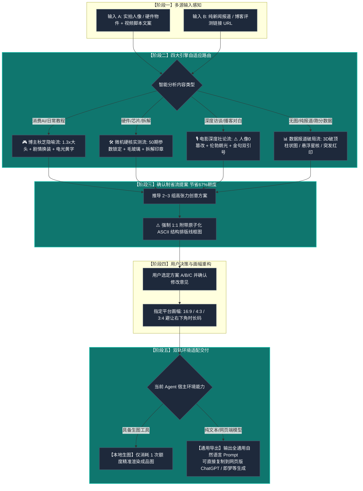

#  Viral Video Cover Designer (视频封面设计引擎)

这是一个为 Antigravity / Claude Code / Cursor / Agent 生态打造的**科技信息品类、高点击率视频封面生成 Skill**。

---

## 🗺️ 全链路执行流程图

---

## 🌟 核心特性速览

- **四大流量引擎自适应**：
  - **博主秋芝隐喻流（默认）**：1.3x 情绪大头 + 脚本剧情 Cosplay 换装 + 3D 悬浮道具 + 电光黄 `#FED700` 立体字。
  - **微机硬核实测流**：50 期样本客观参数锁定，毛玻璃横幅 + 红蓝 VS 撞色 + 大红“拆！”字印章。
  - **电影深度社论流**：**人物绝对 100% 零篡改（0换装/0修脸）**，伦勃朗光影 + 巨型金色金句双引号 `“ ”` + 身份背书铭牌。
  - **数据报道破局流**：无实拍素材时，将跑分与新闻转化为 3D 破顶能量柱、全息科技星核与突发绝密红印章。
- **URL 链接直驱解析**：支持直接输入报道或评测文章链接，自动静默抓取正文与跑分表格提炼爆点。
- **确认制省流工作流**：前置输出 2~3 个带线框图的创意方案，待用户选定后精准单次出图，**节省 67% 生图配额**。
- **方案线框原子契约**：提几个方案就必须强制绑定输出几个专属 ASCII 结构排版线框图，严禁任何方案省略。
- **全平台多比例自适应**：原生适配 `16:9`（B站横屏）、`4:3`（动态卡片）、`3:4`（小红书竖屏），严格避让右下角时长码。
- **模型解耦与零锁死**：动态继承宿主 Agent 当前环境的模型与配额，绝不硬编码任何具体模型名称。
- **单一全通用提示词导出**：在纯文本 Agent 下自动输出纯自然语言通用 Prompt，直接兼容**网页版 ChatGPT、Gemini、Midjourney、即梦、可灵**。

---

## 📂 安装与分发方法

### 本地直接使用
该 Skill 现已自动安装至当前环境：
`C:\Users\ABC\.gemini\config\skills\viral-video-cover-designer\SKILL.md`
Agent 在接收到封面设计或文案配图需求时会自动唤醒。

### 分发给其他用户使用
只需将本目录下的 `SKILL.md` 复制到任何支持 Agent Skills 的目录（如 `~/.gemini/config/skills/` 或 `~/.claude/skills/` 或 `~/.agents/skills/`），即可在任意用户的环境中开箱即用！
