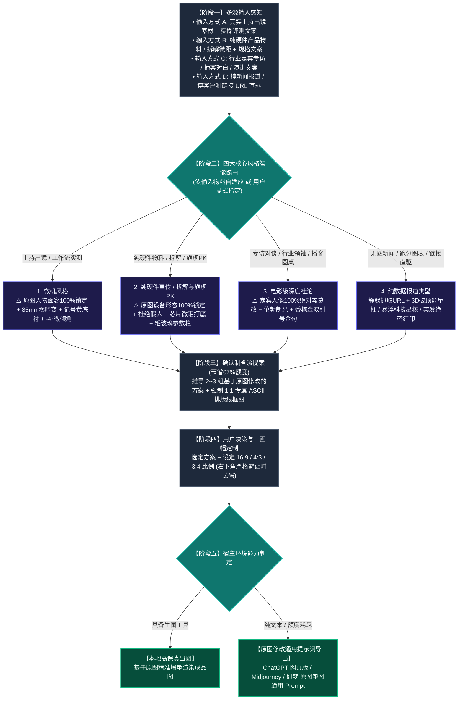

# 🎬 Video Cover Designer (科技数码视频封面设计引擎)

这是一个为 Antigravity / Claude Code / Cursor / Agent 生态打造的**科技数码品类、全场景高点击率视频封面生成 Skill**。

系统精准确立并严格支持**四大核心风格**：
1. **【微机风格】**（真人主持出镜实测与工作流 · 30套样本深度优化）
2. **【纯硬件宣传 / 拆解与旗舰PK】**（无真人出镜 · 芯片微距/拆解/旗舰PK）
3. **【电影级深度社论】**（专访与播客 · 人像100%绝对零篡改 · 伦勃朗光与双引号金句）
4. **【纯数据报道类型】**（零图片素材 · 静默抓取链接 · 3D破顶能量柱与全息星核）

---

## 🔒 核心红线：【基于用户原图修改强绑定协议】

**在生成提示词（Prompt）时，必须向大模型施加强制约束：必须严格基于用户上传的原图进行增量修改与重构，严禁抛弃原图凭空捏造全新主体！**

- **微机风格（真人实操）**：100% 锁定用户原图中的五官面貌、发型、骨骼比例与真实肤质，**绝对禁止生成随机 AI 假人脸或网红脸**；仅做姿态融合与冷暖轮廓光剥离；
- **纯硬件宣传 / 拆解与旗舰PK（无假人）**：100% 忠实保留原图硬件真实外观结构、接口布局、电路特征与品牌 Logo，**绝不替换为凭空幻觉的其他产品**；
- **电影级深度社论（100% 绝对零篡改）**：嘉宾原图面容、眼神表情、发型胡须与西装衣着 **100% 绝对零修改**，仅调整背景为电影级暗调虚化与伦勃朗光；
- **纯数据报道类型（无图直驱）**：静默提取网页文章与表格，若用户提供跑分截图则 1:1 实体化复刻为 3D 发光柱。

---

## 🗺️ 一、 全链路执行流程图



---

## 🚀 二、 四大核心风格深度设计规范

### 1. 🛠️ 风格 1：【微机风格】（真实主持出镜 / 工作流评测流）
- **适用场景**：博主/主持人真人出镜评测、开箱上手、生产力工作流实操。
- **原图锚定与修改要求**：严格保持原图中的五官发貌与形体比例（85mm 真实单反中焦无畸变）；将原图杂乱背景剥离置入暗调极客工作室，微调手势为双手托举或指向硬件，施加冷暖轮廓光。
- **重工字效与色彩**：双行逆时针 **`-3.0° ~ -5.0°` 动感微倾角**；字芯纯白 `#FFFFFF` + 纯黑极粗描边 + 向右下方延伸的 **纯黑 3D 硬实立体投影**；**微机记号笔明黄 `#F8C039` 划痕底衬**；印章根据文案情绪定制（如【首测】、【真香】、【宝藏】）。

### 2. 💻 风格 2：【纯硬件宣传 / 拆解与旗舰PK风格】（无人物出镜 · 拆解与旗舰PK）
- **适用场景**：用户仅提供硬件宣传图、工程样机、主板拆解，或明确要求不出现人物。
- **原图锚定与修改要求**：**⚠️ 坚决杜绝生造假人**！100% 还原原图硬件的物理接口、品牌标牌与电路特征；置入 **100mm 工业微距平视 / 45° 俯拍** 环境，强化金属切角高光反射与电路板微距质感。
- **专用构件**：**半透明毛玻璃通栏（Glassmorphism）** 承载核心参数对比；金属“VS”大标与斜角红色 **【拆！】** 印章。

### 3. 🎙️ 风格 3：【电影级深度社论】（专访对谈 / 播客圆桌 / 领袖对话）
- **适用场景**：专访对话、人物访谈、圆桌论坛、高端播客。
- **原图锚定与修改要求**：**⚠️ 人物 100% 绝对零篡改（Zero Alteration）**！严禁换脸、修脸、改表情、改发型、换衣服或动漫化！100% 忠实保留原摄眼神、皮肤肌理与西装质感；
- **电影级质感**：单侧伦勃朗光影（倒三角高光区），背景沉入电影级暗调；画面一侧运用 **巨型香槟金双引号 `“ ”`** 框定核心原话，下方附带身份背书磨砂铭牌。

### 4. 📊 风格 4：【纯数据报道类型】（零素材链接直驱 / 突发报道）
- **适用场景**：用户仅给出一条新闻 URL、行业资讯链接、发布会文字或纯跑分表格，无任何原始图片。
- **应对方案**：自动静默抓取链接全文与跑分表；生成 **3D 破顶发光能量柱**、**悬浮科技星核**，斜角加盖高饱和度红色【突发】、【重磅】或【绝密】印章，底部贯穿警示黑黄警戒条。

---

## 📐 三、 16:9 / 4:3 / 3:4 三画幅精准重构法则

- **`16:9` (1672×941 横屏 · B站/YouTube)**：左右开阔分栏，**右下角 $[80\%, 100\%] \times [85\%, 100\%]$ 严格留白**，避让时长码；
- **`4:3` (1448×1086 平板/动态卡片)**：横向收紧 10%，大字报字号放大，道具紧贴主体；
- **`3:4` (1086×1448 竖屏海报 · 小红书/抖音/视频号)**：纵向三层重构：顶部标题拆为 3 行垂直堆叠，中部主体居中下，底部横栏贯穿，全屏饱满无黑边。

---

## 🔌 四、 【基于原图修改】单一全通用提示词导出规范

当用户在外部生图平台（网页版 ChatGPT、Midjourney、即梦、可灵等）操作时，必须生成如下**严格基于原图修图指令格式**的通用 Prompt：

```text
【核心修图指令】：
这是一项严格基于我上传的【原图素材】进行修改与重构的专业视频封面制作任务。请直接以我提供的原图为主体基准进行局部增量修改、环境融合与专业大字报排版叠加，严禁抛弃原图凭空捏造全新的陌生人物或硬件！

【原图主体保真与增量修改】：
• 原图主体锚定：[若为真人：100% 锁定我上传原图中的人物五官面容、发型与骨骼比例，绝不换脸/改长相；若为纯硬件：100% 锁定原图硬件的物理外形、接口与品牌标识，绝不生成假人；若为访谈：原图人物 100% 绝对零篡改]；
• 姿态与局部微调：[根据文案描述手势互动，如：主播双手自然托举/指向硬件，神态专注专业]；
• 主体光影重构：在主体边缘施加通透的冷调（科技青）或暖调漫反射轮廓光，将原图主体从杂乱背景中干净剥离，自然融入深色科技工作室背景。

【排版与重工立体大字】：
• 画面比例：[16:9 / 3:4 / 4:3]；
• 经典大字报双行排版：'[核心标题]'；
• 字体整体逆时针 -4.0 度动感微倾斜，核心词带有微机亮黄（#F8C039）矩形划痕底衬，纯白文字外包纯黑极粗描边与深厚硬实的纯黑 3D 硬立体投影；
• 点缀元素：[根据风格添加：斜角印章【首测】/ 半透明毛玻璃参数通栏 / 巨型香槟金双引号 / 黑黄警戒胶带]；
• 画面右下角严格留空 20%，避开视频播放器时长码遮挡。

【环境与场景氛围】：
• 专业暗调科技工作台，景深自然虚化，工业感与公信力十足。
```

### 💡 各外部平台实操建议：
- **在 ChatGPT (网页版)**：点击输入框附件按钮上传您的原图，随后直接粘贴上述提示词发送；
- **在 Midjourney**：先上传原图获取图片链接，采用图生图指令：`[原图URL] [上述提示词] --iw 2.0 --ar 16:9`（`--iw 2.0` 确保最大程度锁定原图特征）；
- **在 即梦 / 可灵 / 智谱清言**：切换至【图生图 / 参考图】模式，上传原图并勾选【保持主体一致】，输入上述提示词即可生成。

---

## 📂 五、 安装与使用方法

只需将本目录下的 `SKILL.md` 复制到任何支持 Agent Skills 的目录（如 `~/.gemini/config/skills/` 或 `~/.claude/skills/` 或 `~/.agents/skills/`），即可开箱即用！
