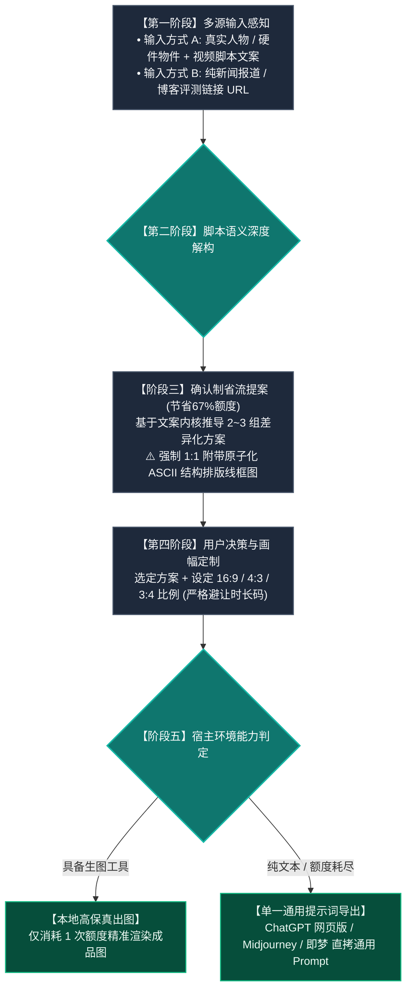

#  Video Cover Designer (视频封面设计引擎)

这是一个为 Antigravity / Claude Code / Cursor / Agent 生态打造的**科技数码品类、高点击率视频封面生成 Skill**。

---

## 🎨 一、 核心设计哲学：品牌视觉统一性 × 脚本语义有机衍生

核心目标：**让观众在信息流中一眼就能认出是同一频道的专业高品质封面（统一视觉调性），同时每一个封面都完全根植于具体脚本文案进行有机创新（杜绝死板套模板与机械照搬）。**

```
【统一的视觉语法体系】 ➡️ 确立频道辨识度（一眼认出是同一种工业级爆款画风）
        ✖️
【具体文案的有机创新】 ➡️ 赋予每期封面独特的灵魂与戏剧张力（杜绝照搬往期贴纸）
```

- **统一视觉语法（保持频道调性）**：
  - **摄影质感**：85mm 标准单反人像中焦，1:1 真实人体比例，**彻底杜绝大头鱼眼畸变**；
  - **排版形态**：经典双行结构，字体整体逆时针 **`-3.0° ~ -5.0°` 动感微倾角**；
  - **重工字效**：字芯 + 纯黑极粗描边 + 向右下方硬朗延伸的 **纯黑 3D 硬实立体投影**；
  - **标志色彩**：纯白主字 `#FFFFFF` 搭配高饱和微机明黄 `#F8C039` / `#FED700`；
  - **安全构图**：右下角 20% 空间严格留白，彻底避让播放器时长码。
- **有机文案创新（拒绝机械照搬）**：
  - **印章是情绪放大器**：根据文案定制词汇（如防骗写【别被骗了！】，冷门写【宝藏】，实测写【首测】，深度写【深扒】）；
  - **划痕底衬提炼关键词**：高光黄划痕底衬精确锁定文案中最具吸引力的核心词或型号；
  - **道具因题而生**：机械臂呈现精工金属，大模型呈现发光星核，对比视频才呈现对决元素。

---

## 🗺️ 全链路执行流程图



---

## 📐 三、 16:9 / 4:3 / 3:4 三画幅精准重构法则

- **`16:9` (1672×941 横屏)**：左右开阔分栏，右下角 20% 留空避让时长码；
- **`4:3` (1448×1086 平板/动态)**：横向收紧 10%，大字报字号放大；
- **`3:4` (1086×1448 竖屏海报)**：纵向三层重构：顶部标题拆为 3 行垂直堆叠，中部主体居中下，底部横栏贯穿，全屏饱满无黑边。

---

## 📂 安装方法
只需将本目录下的 `SKILL.md` 复制到任何支持 Agent Skills 的目录（如 `~/.gemini/config/skills/` 或 `~/.claude/skills/` 或 `~/.agents/skills/`），即可在任意用户的环境中开箱即用！
