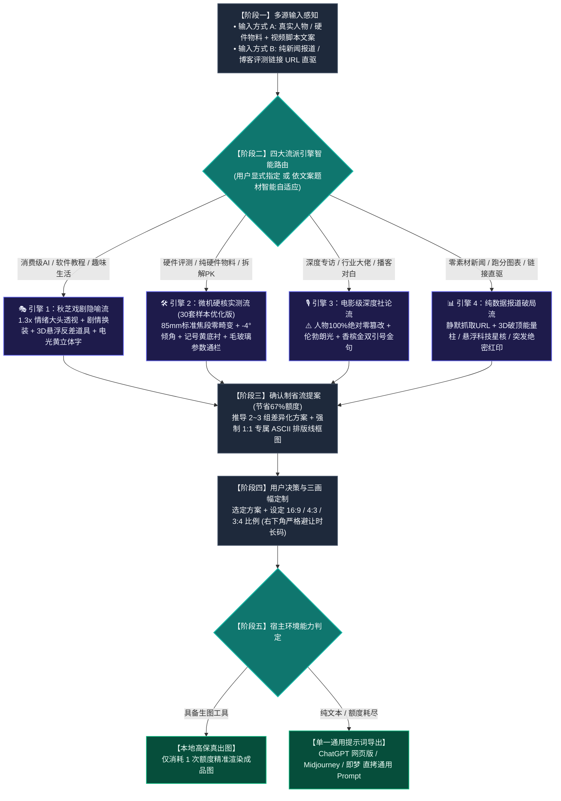

# 🎬 Viral Video Cover Designer (全平台高点击率视频封面设计引擎)

这是一个为 Antigravity / Claude Code / Cursor / Agent 生态打造的**科技信息与数码品类、全场景高点击率视频封面生成 Skill**。

---

## 🗺️ 一、 全链路执行流程图

---

## 🌟 二、 四大流派核心引擎速览

### 1. 🎭 引擎一：【秋芝戏剧隐喻流】（消费级 AI / 软件教程 / 科技趣味生活）
- **核心特色**：以“大头情绪透视 + 剧情身份 Cosplay + 拟物化反差道具”打破平庸，极具视觉吸睛张力。
- **人像体系**：锁定原摄五官发型，微放大 1.25x~1.35x 表现夸张微表情；根据文案剧情换装（长袍、探长、法师、外科医生等）。
- **3D 反差道具**：将核心痛点具象化为缩小或放大的反差物体（如雷神之锤、带血断头闸、黄金魔方）。
- **字效规范**：**秋芝电光黄 `#FED700`**，双层纯黑粗描边 + 向右下方延伸的纯黑 3D 硬实立体投影。

### 2. 🛠️ 引擎二：【微机硬核实测流】（30 套样本工程优化版 · 硬件与实操专属）
- **核心特色**：深度融入【微型计算机】30 套真实爆款封面工程逆向提取的标准工业语法，严谨公信。
- **摄影与透视铁律**：
  - **彻底杜绝大头鱼眼畸变**！严格采用 **85mm 标准单反人像中焦（1:1 真实骨骼比例）** 或 **100mm 工业微距**；
  - **纯硬件宣传物料：⚠️ 坚决杜绝生造假人**！严禁凭空生成虚假 AI 假人，镜头聚焦芯片蚀刻、主板走线、电容阵列与 CNC 切角；
- **标志性视觉语法**：
  - 双行结构，单行 6~8 字，逆时针 **`-3.0° ~ -5.0°` 动感微倾角**；
  - 字芯纯白 `#FFFFFF` + 纯黑极粗描边 + 向右下方延伸的 **纯黑 3D 硬实立体投影**；
  - **微机记号笔明黄 `#F8C039` 划痕底衬**，紧扣文案核心关键词或硬件型号；
  - **半透明毛玻璃通栏（Glassmorphism）** 承载跑分与参数对比；
  - 印章根据文案情绪有机定制（实操【首测】、防骗【别被骗了！】、冷门【宝藏】、拆解【拆！】）。

### 3. 🎙️ 引擎三：【电影级深度社论流】（行业专访 / 大佬对话 / 播客圆桌）
- **核心特色**：高端纪录片与顶级商业杂志质感，建立无可挑剔的思想深度与行业权威。
- **⚠️ 红线铁律**：**人物 100% 绝对零篡改（Zero Alteration）**！绝不换脸、修脸、改表情、改衣着或动漫化，100% 忠实保留原摄真实眼神、皮肤肌理与西装质感。
- **视觉构件**：单侧伦勃朗光影（三角高光区） + 巨型香槟金双引号 `“ ”` 框定破局金句 + 身份背书深色磨砂铭牌。

### 4. 📊 引擎四：【纯数据报道破局流】（零素材链接直驱 / 新闻突发）
- **核心特色**：用户无任何原始图片素材时，仅需丢入一条新闻/官方博客 URL 或纯跑分表格即可直驱成图。
- **视觉转化**：自动静默抓取正文与表格，提炼反差倍率与竞品；生成 **3D 破顶发光能量柱**（伴随雷电碎裂特效碾压竞品）、**悬浮科技星核**、斜角高饱和度红色【突发】、【重磅】或【绝密】印章。

---

## 📐 三、 16:9 / 4:3 / 3:4 三画幅精准重构法则

- **`16:9` (1672×941 横屏 · B站/YouTube)**：左右开阔分栏，**右下角 $[80\%, 100\%] \times [85\%, 100\%]$ 严格留白**，避让时长码；
- **`4:3` (1448×1086 平板/动态卡片)**：横向收紧 10%，大字报字号放大，道具紧贴主体；
- **`3:4` (1086×1448 竖屏海报 · 小红书/抖音/视频号)**：纵向三层重构：顶部标题拆为 3 行垂直堆叠，中部主体居中下，底部横栏贯穿，全屏饱满无黑边。

---

## 🚦 四、 确认制省流工作流与原子契约

为避免盲目生图浪费 67% 配额，严格执行：
1. **多模态语义解析**：输入素材与脚本文案，自动判定并锁定适配的流派引擎（或遵照用户显式指定）；
2. **推导 2~3 组紧扣文案的差异化方案**：每个方案强制绑定**「原子化五要素」**，提几个方案就必须紧跟几个 **专属 1:1 ASCII 结构排版线框图**，严禁任何方案省略；
3. **用户确认后单次精准出图**（或导出单一全通用提示词，直接复制至网页版 ChatGPT、Gemini、Midjourney、即梦生成）。

---

## 📂 五、 安装与使用方法

只需将本目录下的 `SKILL.md` 复制到任何支持 Agent Skills 的目录（如 `~/.gemini/config/skills/` 或 `~/.claude/skills/` 或 `~/.agents/skills/`），即可开箱即用！
