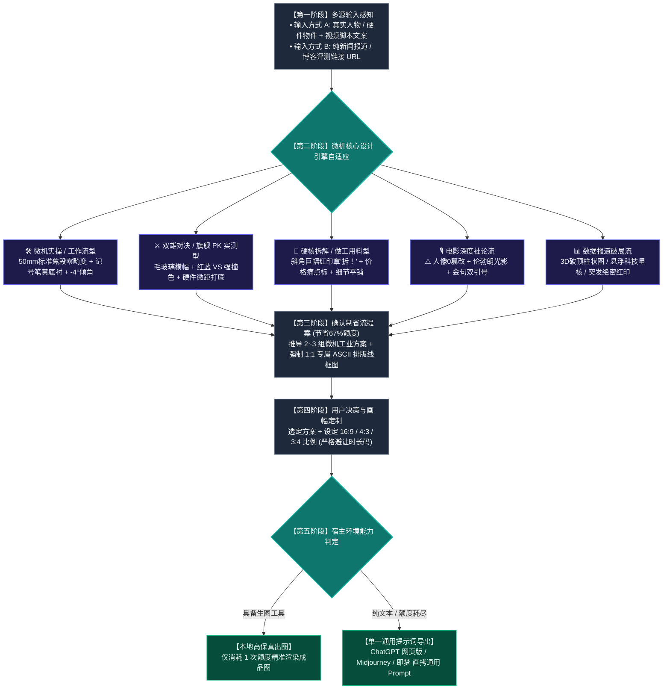

#  Video Cover Designer (视频封面设计引擎 · 微机实测标准版)

这是一个为 Antigravity / Claude Code / Cursor / Agent 生态打造的**科技数码品类、高点击率视频封面生成 Skill**。

---

## 🗺️ 全链路执行流程图

---

## 🌟 核心特性速览

- **微型计算机 50 期实测参数锁定（彻底杜绝镜头畸变）**：
  - **零畸变摄影规范**：坚决摒弃夸张大头与鱼眼镜头，严格采用 **50mm~85mm 标准单反人像镜头与平视微距视角**，呈现 1:1 自然真实的人体与硬件工业质感。
  - **双行排版与 -4.0° 倾角**：84% 样本遵循经典双行结构，单行 6~8 字，逆时针倾斜 -4.0°，带来极强工整感与速度感。
  - **微机标志色彩池**：纯白文字 `#FFFFFF`、纯黑描边 `#000000`、**微机记号笔鲜明黄底衬 `#F8C039`**、高饱和警示红 `#ED1C24`、科技群青蓝 `#00A3E0`。
  - **经典图形资产**：半透明毛玻璃对决横幅（Glassmorphism）、醒目红底白字印章（**“拆！”**、**“首测”**、**“实战”**）。
- **专项保留流派**：
  - **电影深度社论流（访谈专享）**：**人物 100% 绝对零篡改**，保留真实眼神与服饰，伦勃朗光影 + 巨型金句双引号 `“ ”`。
  - **数据报道破局流（无图链接直驱）**：自动抓取报道与跑分表格，生成 3D 破顶能量柱、科技星核与突发绝密红印。
- **确认制省流工作流**：前置输出 2~3 个带线框图的创意方案，待用户选定后精准单次出图，**节省 67% 生图配额**。
- **方案线框原子契约**：提几个方案就必须强制绑定输出几个专属 ASCII 结构排版线框图，严禁任何方案省略。
- **全平台多比例自适应**：原生适配 `16:9`（B站横屏）、`4:3`（动态卡片）、`3:4`（小红书竖屏），严格避让右下角时长码。
- **模型解耦与零锁死**：动态继承宿主 Agent 当前环境的模型与配额，绝不硬编码任何具体模型名称。
- **单一全通用提示词导出**：在纯文本 Agent 下自动输出纯自然语言通用 Prompt，直接兼容**网页版 ChatGPT、Gemini、Midjourney、即梦、可灵**。

---

## 📂 安装方法
只需将本目录下的 `SKILL.md` 复制到任何支持 Agent Skills 的目录（如 `~/.gemini/config/skills/` 或 `~/.claude/skills/` 或 `~/.agents/skills/`），即可在任意用户的环境中开箱即用！
