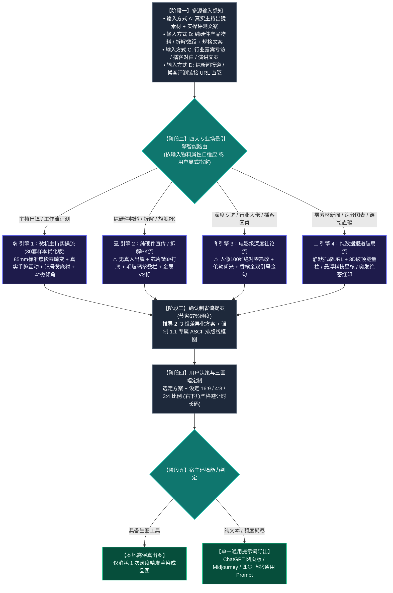

# 🎬 Video Cover Designer (科技数码视频封面设计引擎)

这是一个为 Antigravity / Claude Code / Cursor / Agent 生态打造的**科技数码品类、全场景高点击率视频封面生成 Skill**。

---

## 🗺️ 一、 全链路执行流程图

---

## 🚀 二、 四大专业场景引擎深度规范

### 1. 🛠️ 引擎一：【微机主持实操 / 工作流评测流】（真人出镜评测）
- **适用场景**：博主/主持人出镜评测、开箱上手、生产力工作流实战。
- **摄影与透视铁律**：
  - **彻底杜绝鱼眼与大头畸变**！严格采用 **85mm 标准单反人像中焦（1:1 真实骨骼比例）**；
  - **真实手势交互**：主播双手自然托举硬件、视线聚焦产品、或单手指向核心痛点，神态严谨专业；
- **重工字效与色彩**：
  - 双行结构，单行 6~8 字，逆时针 **`-3.0° ~ -5.0°` 动感微倾角**；
  - 字芯纯白 `#FFFFFF` + 纯黑极粗描边 + 向右下方延伸的 **纯黑 3D 硬实立体投影**；
  - **微机记号笔明黄 `#F8C039` 划痕底衬**，紧扣文案核心关键词或硬件型号；
  - 印章根据文案情绪有机定制（实操【首测】、防骗【别被骗了！】、冷门【宝藏】）。

### 2. 💻 引擎二：【纯硬件宣传 / 拆解与旗舰PK流】（无人物出镜）
- **适用场景**：**用户仅提供硬件宣传图、工程样机、主板拆解，或明确要求不出现人物**。
- **应对方案**：
  - **⚠️ 绝对铁律：坚决杜绝生造假人！** 严禁凭空生成虚假 AI 假人，镜头专注于工业硬件本身的纯粹美学；
  - **工业微距质感**：采用 **100mm 工业微距平视 / 45° 俯拍**，凸显芯片蚀刻纹理、主板电容阵列、CNC 金属倒角与散热鳍片；
  - **半透明毛玻璃通栏（Glassmorphism）**：横向贯穿画面中下部，承载核心技术参数对比（跑分、功耗、制程）；
  - **PK 对决与拆解**：旗舰对比启用“VS”双雄撞色（英特尔蓝 vs AMD 红）；拆解评测加盖斜角红色 **【拆！】** 或 **【做工深扒】** 实底印章。

### 3. 🎙️ 引擎三：【电影级深度社论流】（访谈 / 对话播客）
- **适用场景**：**专访对话、人物访谈、圆桌论坛、大佬播客**。
- **应对方案**：
  - **⚠️ 核心红线：人物 100% 绝对零篡改（Zero Alteration）！** 严禁换脸、修脸、改表情、改发型、换衣服或动漫化！100% 忠实保留嘉宾原摄眼神、真实皮肤肌理与西装质感；
  - **电影级伦勃朗光影**：面部呈现标志性倒三角高光区，背景沉入电影级暗调，营造严肃社论与权威深度质感；
  - **香槟金双引号金句框**：画面一侧运用巨型开闭双引号 `“ ”`，直接框定嘉宾最具穿透力的核心原话；
  - **身份背书铭牌**：嘉宾下方附带精致深色磨砂名牌（如“OpenAI 首席架构师”），确立行业权威。

### 4. 📊 引擎四：【纯数据报道破局流】（零素材链接直驱）
- **适用场景**：**用户仅给出一条新闻 URL、行业资讯链接、发布会文字或纯跑分表格，无任何原始图片**。
- **应对方案**：
  - 自动静默抓取链接全文与跑分数据表，提炼核心反差与竞品；
  - **3D 破顶能量柱 / 跑分阶梯柱状图**：将悬殊的性能差距（如 300% 提升）转化为直冲云霄的发光能量柱，直观呈现算力鸿沟；
  - **悬浮科技星核 / 芯片光路**：将抽象的模型算法与系统升级具象化为发光的悬浮科技星核；
  - 斜角加盖高饱和度红色 **【突发】**、**【重磅】** 或 **【绝密】** 印章，底部贯穿警示黑黄警戒条。

---

## 📐 三、 16:9 / 4:3 / 3:4 三画幅精准重构法则

- **`16:9` (1672×941 横屏 · B站/YouTube)**：左右开阔分栏，**右下角 $[80\%, 100\%] \times [85\%, 100\%]$ 严格留白**，避让时长码；
- **`4:3` (1448×1086 平板/动态卡片)**：横向收紧 10%，大字报字号放大，道具紧贴主体；
- **`3:4` (1086×1448 竖屏海报 · 小红书/抖音/视频号)**：纵向三层重构：顶部标题拆为 3 行垂直堆叠，中部主体居中下，底部横栏贯穿，全屏饱满无黑边。

---

## 🚦 四、 确认制省流工作流与原子契约

为避免盲目生图浪费 67% 配额，严格执行：
1. **多模态语义解析**：输入素材与脚本文案，自动判定并锁定适配的专业引擎；
2. **推导 2~3 组紧扣文案的差异化方案**：每个方案强制绑定**「原子化五要素」**，提几个方案就必须紧跟几个 **专属 1:1 ASCII 结构排版线框图**，严禁任何方案省略；
3. **用户确认后单次精准出图**（或导出单一全通用提示词，直接复制至网页版 ChatGPT、Gemini、Midjourney、即梦生成）。

---

## 📂 五、 安装与使用方法

只需将本目录下的 `SKILL.md` 复制到任何支持 Agent Skills 的目录（如 `~/.gemini/config/skills/` 或 `~/.claude/skills/` 或 `~/.agents/skills/`），即可开箱即用！
