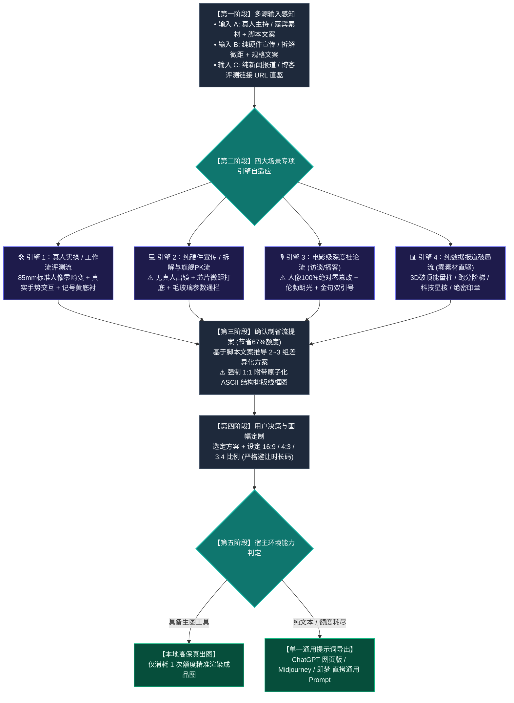

# Video Cover Designer (科技视频封面设计引擎 · 全场景工业自适应版)

本 Skill 旨在解决科技数码创作者“要么毫无章法风格散乱，要么死板套模板千篇一律”的痛点。
核心目标：**让观众在信息流中一眼就能认出是同一频道的专业高品质封面（统一视觉调性），同时依据不同的输入类型（纯硬件、深度访谈、真人实操、纯数据直驱）自适应匹配专业引擎，并完全根植于具体脚本文案进行有机创新（杜绝机械套模板与死板照抄）。**

---

## 🎨 一、 核心设计哲学：品牌视觉统一性 × 脚本语义有机衍生

```
【统一的视觉语法体系】 ➡️ 确立频道辨识度（一眼认出是同一种工业级爆款画风）
        ✖️
【四大场景专项引擎】   ➡️ 精准应对纯硬件、访谈播客、真人实操、纯数据等不同素材
        ✖️
【具体文案的有机创新】 ➡️ 赋予每期封面独特的灵魂与戏剧张力（杜绝照搬往期贴纸）
```

### 1. 什么是让观众一眼认出的「统一视觉语法」（必须保持一致）：
- **摄影质感**：85mm 标准单反中焦人像 / 100mm 工业微距平视，1:1 真实人体与硬件比例，**彻底杜绝大头鱼眼畸变**，主体边缘带有通透的冷暖漫反射轮廓光；
- **排版形态**：经典双行结构，字体整体逆时针 **`-3.0° ~ -5.0°` 动感微倾角**；
- **重工字效**：字芯 + 纯黑极粗描边 + 向右下方硬朗延伸的 **纯黑 3D 硬实立体投影**（绝不发虚）；
- **标志色彩**：纯白主字 `#FFFFFF` 搭配高饱和微机明黄 `#F8C039` / `#FED700`，辅以点睛警示红或极光蓝；
- **构图呼吸感**：主体与文案左右/上下均衡分布，右下角 20% 空间严格留白避让时长码。

### 2. 什么是必须根据文案「有机创新」的（拒绝死板套用）：
- **印章是情绪放大器，非固定死标签**：
  - 往期用了【别被骗了！】是因为那期讲防骗，不可无脑照搬；
  - 遇到冷门开源项目，印章有机演化为 **【宝藏】**、**【冷门实测】** 或 **【真香】**；
  - 遇到重磅发布，演化为 **【首发】**、**【深扒】** 或 **【绝密】**；
- **记号笔底衬是提炼核心词，非全篇乱抹**：
  - 微机亮黄划痕底衬，必须根据文案精准提炼该期最吸睛的核心词或型号（如“8700G”、“DeepSeek-V3”）；
- **核心道具必须与文案产生直接化学反应**：
  - 讲机械爪就呈现精工机械结构，讲大模型就呈现悬浮星核，对比视频才呈现对决元素。

---

## 🚀 二、 四大场景专项引擎（根据输入素材与文案精准路由）

面对创作者千差万别的输入形态，Skill 绝不搞一刀切，而是根据素材与内容类型自适应启用四大工业引擎：

### 🛠️ 引擎一：【真人主持实操 / 工作流评测流】（出镜实测专属）
* **触发条件**：用户提供主持人/出镜作者照片 + 评测实操文案。
* **构图摄影**：
  - 主播位于画面一侧（常驻右侧或左侧 1/2），**85mm 标准单反人像中焦，1:1 真实骨骼比例，彻底杜绝鱼眼大头**；
  - 真实手势交互：双手托举硬件、视线聚焦点、单手指向核心痛点，人物神态专注自信；
  - 人像边缘施加通透的冷调（科技青）或暖调轮廓光，与深色工作台背景干净分层。
* **排版定制**：双行 `-4.0°` 倾斜字，第一行加微机黄底衬，第二行纯白黑边重工字。

### 💻 引擎二：【纯硬件宣传 / 拆解与旗舰PK流】（无人物出镜·硬件专属）
* **触发条件**：用户仅提供硬件产品图、工程样机、拆解电路板、跑分对比，或要求**纯硬件展示、无真人出镜**。
* **构图摄影**：
  - **⚠️ 绝对铁律：严禁凭空生成虚假真人！** 坚决专注于工业硬件本身的纯粹工业美学；
  - 极客工程工作台、防静电硅胶垫或深邃哑光金属台面；
  - **100mm 工业微距平视 / 45° 俯拍**：芯片蚀刻纹理、主板电容阵列、散热鳍片倒角、CNC 极客质感；
  - 旗舰对决时采用冷暖双区光影对冲（如英特尔蓝 vs AMD 红）；拆解时采用外壳与主板平行分解陈列。
* **视觉构件定制**：
  - **半透明毛玻璃通栏（Glassmorphism）**：横贯画面中下部，承载核心参数对比（制程、频率、功耗、价格）；
  - 对决类使用金属撕裂质感的 **“VS”** 大标；拆解类加盖斜角红色 **【拆！】** 或 **【做工深扒】** 实底印章。

### 🎙️ 引擎三：【电影级深度社论流】（访谈 / 对话播客专属）
* **触发条件**：用户提供人物专访、圆桌对话、播客录音、或行业大佬演讲文案。
* **构图摄影**：
  - **⚠️ 绝对红线铁律：人像 100% 绝对零篡改（Zero Alteration）！** 严禁换脸、修脸、改表情、改衣着、改发型或卡通化！必须 100% 忠实保留嘉宾原摄眼神、真实皮肤肌理与西装/衬衫质感；
  - 单侧**伦勃朗光影（Rembrandt Lighting）**：面部呈现标志性倒三角高光区，背景沉入电影级暗调，极具严肃社论与权威纪录性质感。
* **视觉构件定制**：
  - **巨型双引号框定破局金句**：画面一侧呈现香槟金或纯白开闭双引号 `“ ”`，内部框定嘉宾最具思想冲击力的原话（单行 6~10 字）；
  - **身份背书铭牌**：嘉宾下方附带精致的磨砂深色金属名牌（如“OpenAI 首席科学家”、“前特斯拉硬件工程总监”），确立权威背书；
  - 斜角实底印章选用 **【深度专访】**、**【独家对话】** 或 **【内幕】**。

### 📊 引擎四：【纯数据报道破局流】（无图链接直驱专属）
* **触发条件**：用户仅输入一条新闻 URL、评测文章链接、发布会文本或跑分数据，没有任何原始图片素材。
* **构图与视觉具象化**：
  - 自动静默解析链接内容，提炼核心结论与悬殊数据对比；
  - **3D 破顶能量柱 / 跑分阶梯柱状图**：将悬殊的性能差距（如 300% 提升、能效比翻倍）转化为直冲云霄的发光能量柱，直观展示算力鸿沟；
  - **悬浮科技星核 / 全息光路芯片**：将抽象的算法模型、架构升级或开源代码具象化为发光的悬浮星核；
  - 斜角加盖高饱和度红色 **【突发】**、**【重磅】** 或 **【绝密】** 印章；
  - 底部配置横贯式的黑黄警戒胶带或性能跑分参数栏。

---

## 🗺️ 三、 全链路执行工作流



---

## 🧩 四、 视觉语法资产池（按引擎与文案有机选用）

| 构件资产 | 统一的视觉语法（同一画风） | 场景引擎与文案有机定制 |
| :--- | :--- | :--- |
| **斜角实底印章** | 斜角 15°~30°，红色或黄色方框印章质感 | 根据文案情绪定制：实操【首测】、防骗【别被骗了！】、冷门【宝藏】、拆解【拆！】、访谈【独家对话】、报道【突发】。 |
| **记号笔底衬** | 微机亮黄 `#F8C039` 矩形笔刷划痕 | 紧密包裹文案中最关键的搜索词、型号或痛点标签。 |
| **毛玻璃通栏** | 半透明磨砂通栏（Glassmorphism） | 纯硬件流与 PK 流专属，横贯承载跑分、能效比、价格对比。 |
| **金句双引号** | 香槟金或纯白开闭立体巨型引号 `“ ”` | 深度访谈流专属，框定嘉宾最具穿透力的核心论点。 |
| **对决与悬念标** | 撕裂水彩质感、手绘爆炸贴纸 | 仅在文案具有对抗/对比时使用，非对决文案严禁滥用。 |

---

## 🚦 五、 确认制提案与原子化五要素协议

为避免盲目生图浪费 67% 配额，严格执行：
1. **多模态语义解析**：输入素材与脚本文案，自动判定并锁定适配的场景引擎；
2. **推导 2~3 组紧扣文案的差异化方案**（在统一的微机工业画风下，提供不同叙事角度）；
3. **每个方案强制绑定「原子化五要素」**：
   - `【方案名称】`：引擎类别与创意主题；
   - `【主体形态与视角】`：无畸变透视（真人 85mm / 硬件微距），零假人捏造，访谈 100% 零篡改；
   - `【剧情道具与光影】`：与文案有机结合的核心物体与专业灯光；
   - `【大字报文案与字效】`：-4.0° 微倾角，微机黄底衬 + 纯白重工立体字；
   - **`【专属 ASCII 结构排版线框图】`（强制 1:1 必填，提几个方案画几个，严禁缺失！）**；
4. **用户确认后单次精准出图**（或导出单一全通用提示词）。

---

## 📐 六、 16:9 / 4:3 / 3:4 三画幅重构矩阵

- **`16:9` (1672×941 横屏)**：左右开阔分栏，右下角 20% 空间严格留白避让时长码；
- **`4:3` (1448×1086 平板/动态)**：横向收拢 10%，大字报字号放大；
- **`3:4` (1086×1448 竖屏海报)**：纵向三层重构：顶部标题拆为 3 行垂直堆叠，中部主体居中下，底部横栏贯穿，全屏饱满无黑边。

---

## 🔌 七、 单一全通用提示词导出标准

```text
请为我生成一张 [画幅比例，如 16:9 / 3:4 / 4:3] 的专业科技数码爆款视频封面。

【核心构图与摄影标准】：
• [真人实操/纯硬件/深度访谈场景自适应规范]：真实单反相机 85mm 人像质感 / 100mm 硬件微距平视，1:1 真实人体与硬件比例，零镜头畸变，彻底杜绝大头鱼眼变形；
• 主体严格参考我提供的素材：[描述人物/硬件及具体状态；若为纯硬件则严禁生成任何人物；若为访谈则 100% 保持人物面容不变]；
• 主体边缘带有通透的冷暖环境漫反射轮廓光，将主体与深色科技背景干净剥离。

【排版与重工立体大字】：
• 经典双行结构，字体整体逆时针 -4.0 度微动感倾斜：'[核心标题]'；
• 核心型号/重点词带有微机亮黄（#F8C039）矩形底衬，主文字纯白，外包粗黑描边与厚重的纯黑 3D 硬实立体投影；
• [根据文案有机点缀印章、毛玻璃通栏或金句双引号]；
• 画面右下角严格留空，避开视频播放器时长码。

【场景与核心道具】：
• [严格契合文案的核心道具与工作台场景]；
• 暗调科技工作室质感，景深自然虚化，工业感与公信力十足。
```
