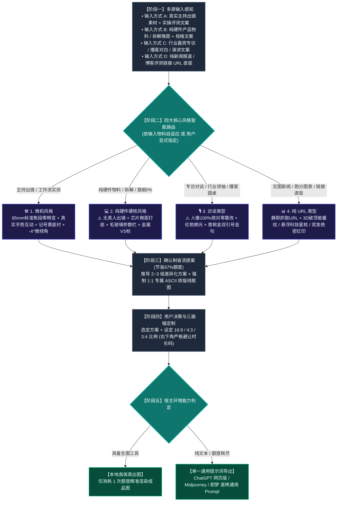

# Viral Video Cover Designer (科技视频封面设计引擎 · 四大核心风格标准版)

本 Skill 旨在解决科技数码及深度内容创作者“做不出吸睛爆款封面、或面对纯硬件/访谈等不同物料时缺乏专业策略”的痛点。
系统精准确立并严格支持**四大核心风格**：
1. **【微机风格】**（真人出镜实测与工作流 · 30套样本深度优化）
2. **【纯硬件硬核风格】**（无真人出镜 · 芯片微距/拆解/旗舰PK）
3. **【访谈类型】**（专访与播客 · 人像100%绝对零篡改 · 伦勃朗光与双引号金句）
4. **【纯 URL 类型】**（零图片素材 · 静默抓取链接 · 3D破顶能量柱与全息星核）

---

## 🗺️ 一、 全链路执行流程图



---

## 🎨 二、 四大核心风格深度设计规范

### 🛠️ 风格 1：【微机风格】（真实主持出镜 / 工作流评测流）
* **适用场景**：博主/主持人真人出镜评测、开箱上手、生产力工作流实战。
* **摄影透视与人像规范（30 套样本逆向提取）**：
  - **彻底杜绝广角畸变与大头鱼眼！** 严格采用 **85mm 标准单反人像中焦（1:1 真实骨骼比例）**；
  - **真实手势交互**：主播双手自然托举硬件、视线聚焦产品、或单手指向核心痛点，神态严谨专注；
  - 人像边缘施加通透的冷暖漫反射轮廓光，干净剥离深色科技工作室背景。
* **微机重工字效与标志色彩**：
  - 经典双行结构，单行 6~8 字，文字整体逆时针 **`-3.0° ~ -5.0°` 动感微倾角**；
  - 字芯纯白 `#FFFFFF` + 纯黑极粗描边 + 向右下方硬朗延伸的 **纯黑 3D 硬实立体投影**；
  - **微机记号笔明黄 `#F8C039` 矩形划痕底衬**，紧扣文案核心关键词或硬件型号；
  - 斜角实底印章（按文案有机衍生：如【首测】、【真香】、【宝藏】）。

---

### 💻 风格 2：【纯硬件硬核风格】（无人物出镜 · 拆解与旗舰PK）
* **适用场景**：**用户仅提供硬件产品物料、工程样机、拆解主板、或明确要求不出现人物**。
* **构图摄影与核心铁律**：
  - **⚠️ 绝对铁律：坚决杜绝生造虚假假人！** 严禁凭空注入 AI 虚拟人物，全心专注于硬件自身的工业美学；
  - **极客质感平视/微距**：采用 **100mm 工业微距平视 / 45° 俯拍**，聚焦芯片蚀刻纹理、主板电容阵列、CNC 金属倒角与散热鳍片；
  - 极客工程工作台、防静电硅胶垫或深邃哑光金属台面；
  - 双雄对决（PK）时采用冷暖双区光影对冲（如英特尔蓝 vs AMD 红）；拆解评测时采用外壳与主板平行分解陈列。
* **专用构件与字效**：
  - **半透明毛玻璃通栏（Glassmorphism）**：横向贯穿画面中下部，承载核心技术参数对比（跑分、制程、功耗、价格）；
  - 对决类使用金属撕裂质感的 **“VS”** 大标；
  - 拆解类加盖斜角巨幅红色 **【拆！】** 或 **【做工深扒】** 实底印章。

---

### 🎙️ 风格 3：【访谈类型】（行业专访 / 播客圆桌 / 大佬对话）
* **适用场景**：专访对话、行业领袖对谈、圆桌论坛、高端播客。
* **构图摄影与红线铁律**：
  - **⚠️ 核心红线：人物 100% 绝对零篡改（Zero Alteration）！** 严禁换脸、修脸、改表情、改发型、换衣服或动漫卡通化！100% 忠实保留嘉宾原摄眼神、真实皮肤肌理与西装/衬衫质感；
  - **单侧伦勃朗光影（Rembrandt Lighting）**：面部呈现标志性倒三角高光区，背景沉入电影级暗调环境，极具严肃社论深度与行业权威感。
* **视觉构件与金句排版**：
  - **巨型双引号框定破局金句**：画面一侧呈现香槟金或纯白开闭巨型双引号 `“ ”`，内部框定嘉宾最具穿透力的核心原话（单行 6~10 字）；
  - **身份背书铭牌**：嘉宾下方附带精致深色磨砂金属名牌（如“OpenAI 首席架构师”、“前特斯拉硬件工程总监”），确立权威背书；
  - 斜角实底印章选用 **【深度专访】**、**【独家对话】** 或 **【内幕】**。

---

### 📊 风格 4：【纯 URL 类型】（零素材链接直驱 / 新闻突发报道）
* **适用场景**：**用户没有任何原始图片素材**，仅输入一条新闻 URL、官方发布博客链接、推特、或纯性能跑分数据表格。
* **URL 静默抓取与三维冲突提炼**：
  - 自动调用网络读取工具抓取文章正文与跑分数据表；
  - 提炼核心爆点：大事件定性（突发/重磅）、杀手级数字（如成本降 90%、速度翻 5 倍）、被碾压竞品型号。
* **视觉具象化构件**：
  - **3D 破顶发光能量柱 / 跑分阶梯柱状图**：将悬殊的性能差距转化为直冲云霄的发光能量柱，伴随雷电碎裂特效碾压竞品柱；
  - **悬浮科技星核 / 全息光路芯片**：将抽象的代码算法或架构升级具象化为发光的悬浮科技星核；
  - 斜角加盖高饱和度红色 **【突发】**、**【重磅】** 或 **【绝密】** 印章；
  - 底部配置横贯式的黑黄警戒胶带或性能跑分参数栏。

---

## 🚦 三、 确认制省流提案与原子契约

为最大化保护用户的生图 API 配额（避免盲目生图浪费 67% 额度），严格执行以下工作流：
1. **多模态语义解析**：输入素材与脚本文案，自动判定并锁定适配的核心风格（或遵照用户显式指定）；
2. **推导 2~3 组差异化方案**：每个方案强制绑定**「原子化五要素」**，严禁缺失：
   - `【方案名称】`：风格类别与创意主题；
   - `【主体形态与视角】`：透视规范、真实手势动线（纯硬件硬核微距绝不生造假人 / 访谈100%零篡改）；
   - `【剧情道具与光影】`：核心物体、专业工作室灯光与氛围营造；
   - `【大字报文案与字效】`：具体字数、倾角、主色、底衬与 3D 硬投影；
   - **`【专属 ASCII 结构排版线框图】`（强制 1:1 必填，提几个方案画几个，严禁任何方案省略！）**；
3. **用户确认后单次精准出图**（或导出单一全通用提示词）。

---

## 📐 四、 16:9 / 4:3 / 3:4 三画幅精准重构法则

- **`16:9` (1672×941 横屏 · B站/YouTube)**：左右开阔分栏，**右下角 $[80\%, 100\%] \times [85\%, 100\%]$ 严格留白**，彻底避让播放器时长码；
- **`4:3` (1448×1086 平板/动态卡片)**：横向收紧 10%，大字报字号放大，道具紧贴主体；
- **`3:4` (1086×1448 竖屏海报 · 小红书/抖音/视频号)**：纵向三层重构：顶部标题拆为 3 行垂直堆叠，中部主体居中下，底部横栏贯穿，全屏饱满无黑边。

---

## 🔌 五、 单一全通用提示词导出规范

当宿主 Agent 缺乏生图插件、配额耗尽、或用户需在网页端生成时，输出**唯一全平台通用提示词**（兼容网页端 ChatGPT、Gemini、Midjourney、即梦、可灵）：

```text
请为我生成一张 [画幅比例，如 16:9 / 3:4 / 4:3] 的专业科技数码高点击率视频封面。

【核心风格与摄影透视】：
• 采用 [1.微机风格 / 2.纯硬件硬核风格 / 3.访谈类型 / 4.纯URL类型] 专业标准；
• 主体质感要求：[若有真人出镜严格采用真实单反 85mm 标准中焦零畸变；若为纯硬件硬核风格则严禁生成任何虚拟假人，纯粹聚焦工业微距走线与金属倒角；若为访谈类型则 100% 忠实保留人物原摄面容不变；若为纯 URL 类型则生成 3D 跑分破顶柱状图]；
• 主体边缘带有通透的冷暖漫反射轮廓光，将主体与深色科技背景干净剥离。

【排版与重工立体大字】：
• 经典大字报双行排版：'[核心标题]'；
• 字体整体逆时针 -4.0 度动感微倾斜，核心词带有微机亮黄（#F8C039）矩形底衬，纯白文字外包纯黑极粗描边与深厚硬实的纯黑 3D 立体投影；
• [根据文案与风格点缀印章、毛玻璃通栏、金句双引号或黑黄警戒条]；
• 画面右下角严格留空，避开视频播放器时长码。

【场景与极客氛围】：
• [契合文案的核心道具与暗调科技工作室/极客工作台场景]；
• 工业感与公信力十足，景深自然虚化。
```
