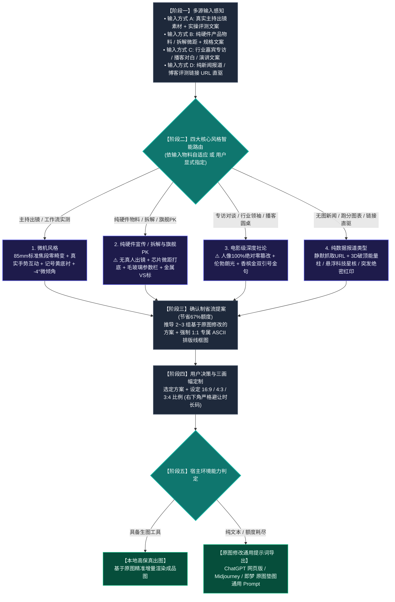

# Viral Video Cover Designer (科技视频封面设计引擎 · 四大核心风格标准版)

本 Skill 旨在解决科技数码及深度内容创作者“做不出吸睛爆款封面、或者大模型生成提示词时随意篡改原图主体、凭空捏造假人假设备”的致命痛点。
系统精准确立并严格支持**四大核心风格**：
1. **【1. 微机风格】**（真人主持出镜实测与工作流 · 30套样本深度优化）
2. **【2. 纯硬件宣传 / 拆解与旗舰PK】**（无真人出镜 · 芯片微距/拆解/旗舰PK）
3. **【3. 电影级深度社论】**（专访与播客 · 人像100%绝对零篡改 · 伦勃朗光与双引号金句）
4. **【4. 纯数据报道类型】**（零图片素材 · 静默抓取链接 · 3D破顶能量柱与全息星核）

---

## 🔒 核心红线：【基于用户原图修改强绑定协议】（Image-to-Image Grounding Protocol）

**在生成提示词（Prompt）时，必须向大模型施加强制约束：必须严格基于用户上传的原图进行增量修改与重构，严禁抛弃原图凭空捏造全新的陌生人物或硬件！**

### 1. 分风格原图保真与修改铁律：
* **在【1. 微机风格】中（真人实操）**：
  - **主体锁定**：必须 100% 锁定用户原图中的五官长相、发型、骨骼比例与真实肤质，**绝对禁止生成随机网红脸、AI 假人脸或卡通脸**；
  - **增量修改**：在原图人物基础上进行增量环境合成——微调手臂与手势（双手托举硬件、自然指向屏幕痛点），在人物边缘施加通透的冷暖漫反射轮廓光，替换杂乱背景为暗调极客工作室。
* **在【2. 纯硬件宣传 / 拆解与旗舰PK】中（硬件物料）**：
  - **主体锁定**：必须 100% 忠实保留用户原图中的硬件设备（主板、显卡、整机、手机、芯片等）真实外形结构、接口布局、散热鳍片、螺丝点位与品牌 Logo，**绝不替换为幻觉出的其他产品**；
  - **增量修改**：将拍摄背景替换为极客防静电工作台或哑光深色金属台面，施加 100mm 工业微距景深，强化金属切角与电路板走线的高光质感，中下部叠加半透明毛玻璃参数通栏。
* **在【3. 电影级深度社论】中（专访对话）**：
  - **主体锁定（100% 绝对零篡改）**：嘉宾面部五官、表情神态、眼神聚焦、发型胡须、乃至西装衬衫完全锁死，**像素级保留真实纪录素质感**；
  - **增量修改**：仅做环境光影与氛围重构——单侧施加电影级伦勃朗光影（三角高光区），背景压暗为高景深暗调工作室，在空白区域框定巨型香槟金双引号金句与身份背书铭牌。
* **在【4. 纯数据报道类型】中（无原图链接直驱）**：
  - 若用户未提供图片，则以抓取的数据表合成 3D 能量柱；若用户提供了新闻截图或官方图表，必须以该截图数据为锚点进行 3D 实体化还原。

---

## 🗺️ 一、 全链路执行流程图



---

## 🎨 二、 四大核心风格深度设计规范

### 🛠️ 1. 微机风格（真实主持出镜 / 工作流评测流）
* **适用场景**：博主/主持人真人出镜评测、开箱上手、生产力工作流实战。
* **原图锚定与修改要求**：
  - 严格保持用户上传原图中的五官发貌与形体比例（85mm 真实单反中焦无畸变）；
  - 修改增量：将原图背景剥离，将人物与深色极客工作室自然融合；调整手势为双手托举或指向硬件，施加冷调科技轮廓光。
* **重工字效与色彩**：
  - 经典双行结构，单行 6~8 字，文字整体逆时针 **`-3.0° ~ -5.0°` 动感微倾角**；
  - 字芯纯白 `#FFFFFF` + 纯黑极粗描边 + 向右下方硬朗延伸的 **纯黑 3D 硬实立体投影**；
  - **微机记号笔明黄 `#F8C039` 矩形划痕底衬**，紧扣文案核心关键词或硬件型号；
  - 斜角实底印章（按文案有机衍生：如【首测】、【真香】、【宝藏】）。

---

### 💻 2. 纯硬件宣传 / 拆解与旗舰PK（无人物出镜 · 拆解与旗舰PK）
* **适用场景**：**用户仅提供硬件产品物料、工程样机、拆解主板、或明确要求不出现人物**。
* **原图锚定与修改要求**：
  - **⚠️ 绝对铁律：严禁凭空生成虚假真人！** 纯粹聚焦硬件本身的工业美学；
  - 100% 还原上传原图硬件的物理接口、品牌标牌与电路特征；
  - 修改增量：置入 **100mm 工业微距平视 / 45° 俯拍** 环境，强化金属切角高光反射、芯片蚀刻细节与电容阵列光影。
* **专用构件与字效**：
  - **半透明毛玻璃通栏（Glassmorphism）**：横向贯穿画面中下部，承载核心技术参数对比（跑分、制程、功耗、价格）；
  - 对决类使用金属撕裂质感的 **“VS”** 大标；
  - 拆解类加盖斜角巨幅红色 **【拆！】** 或 **【做工深扒】** 实底印章。

---

### 🎙️ 3. 电影级深度社论（专访对谈 / 播客圆桌 / 领袖对话）
* **适用场景**：专访对话、行业领袖对谈、圆桌论坛、高端播客。
* **原图锚定与修改要求**：
  - **⚠️ 核心红线：人物 100% 绝对零篡改（Zero Alteration）！** 严禁换脸、修脸、改表情、改发型、换衣服或动漫化！100% 忠实保留嘉宾原摄眼神、真实皮肤肌理与西装/衬衫质感；
  - 修改增量：单侧施加电影级**伦勃朗光影（Rembrandt Lighting）**（倒三角高光区），背景压暗沉入深度电影景深。
* **视觉构件与金句排版**：
  - **巨型双引号框定破局金句**：画面一侧呈现香槟金或纯白开闭巨型双引号 `“ ”`，内部框定嘉宾最具穿透力的核心原话（单行 6~10 字）；
  - **身份背书铭牌**：嘉宾下方附带精致深色磨砂金属名牌（如“OpenAI 首席架构师”），确立权威背书；
  - 斜角实底印章选用 **【深度专访】**、**【独家对话】** 或 **【内幕】**。

---

### 📊 4. 纯数据报道类型（零素材链接直驱 / 新闻突发报道）
* **适用场景**：**用户没有任何原始图片素材**，仅输入一条新闻 URL、官方发布博客链接、推特、或纯性能跑分数据表格。
* **修改与转化逻辑**：
  - 静默抓取正文与跑分表，提炼核心反差倍率与竞品型号；
  - **3D 破顶发光能量柱 / 跑分阶梯柱状图**：将悬殊的性能差距转化为直冲云霄的发光能量柱，伴随雷电碎裂特效碾压竞品柱；
  - **悬浮科技星核 / 全息光路芯片**：将抽象的代码算法或架构升级具象化为发光的悬浮科技星核；
  - 斜角加盖高饱和度红色 **【突发】**、**【重磅】** 或 **【绝密】** 印章，底部配置横贯式的黑黄警戒胶带。

---

## 🚦 三、 确认制省流提案与原子契约

为避免盲目生图浪费 67% 配额，严格执行：
1. **多模态语义解析**：输入素材与脚本文案，自动判定并锁定适配的核心风格；
2. **推导 2~3 组基于原图修改的差异化方案**：每个方案强制绑定**「原子化五要素」**，严禁缺失：
   - `【方案名称】`：风格类别与创意主题；
   - `【主体形态与视角】`：明确注明“基于原图人物/硬件精准锚定”，透视规范、真实手势动线（纯硬件绝无假人 / 访谈100%零篡改）；
   - `【剧情道具与光影】`：核心物体、专业工作室灯光与氛围营造；
   - `【大字报文案与字效】`：具体字数、倾角、主色、底衬与 3D 硬投影；
   - **`【专属 ASCII 结构排版线框图】`（强制 1:1 必填，提几个方案画几个，严禁任何方案省略！）**；
3. **用户确认后单次精准出图**（或导出针对原图修改的通用提示词）。

---

## 📐 四、 16:9 / 4:3 / 3:4 三画幅精准重构法则

- **`16:9` (1672×941 横屏 · B站/YouTube)**：左右开阔分栏，**右下角 $[80\%, 100\%] \times [85\%, 100\%]$ 严格留白**，避让时长码；
- **`4:3` (1448×1086 平板/动态卡片)**：横向收紧 10%，大字报字号放大，道具紧贴主体；
- **`3:4` (1086×1448 竖屏海报 · 小红书/抖音/视频号)**：纵向三层重构：顶部标题拆为 3 行垂直堆叠，中部主体居中下，底部横栏贯穿，全屏饱满无黑边。

---

## 🔌 五、 【基于原图修改】单一全通用提示词导出规范

当用户在外部生图平台（网页版 ChatGPT、Midjourney、即梦、可灵等）操作时，必须生成如下**严格基于原图修图指令格式**的通用 Prompt：

```text
【核心修图指令】：
这是一项严格基于我上传的【原图素材】进行修改与重构的专业视频封面制作任务。请直接以我提供的原图为主体基准进行局部增量修改、环境融合与专业大字报排版叠加，严禁抛弃原图凭空捏造全新的陌生人物或硬件！

【原图主体保真与增量修改】：
• 原图主体锚定：[若为真人：100% 锁定我上传原图中的人物五官面容、发型与骨骼比例，绝不换脸/改长相；若为纯硬件：100% 锁定原图硬件的物理外形、接口与品牌标识，绝不生成假人；若为访谈：原图人物 100% 绝对零篡改]；
• 姿态与局部微调：[根据文案描述手势互动，如：主播双手自然托举/指向硬件，神态专注专业]；
• 主体光影重构：在主体边缘施加通透的冷调（科技青）或暖调漫反射轮廓光，将原图主体从杂乱背景中干净剥离，自然融入深色科技工作室背景。

【排版与重工立体大字】：
• 画面比例：[16:9 / 3:4 / 4:3]；
• 经典大字报双行排版：'[核心标题]'；
• 字体整体逆时针 -4.0 度动感微倾斜，核心词带有微机亮黄（#F8C039）矩形划痕底衬，纯白文字外包纯黑极粗描边与深厚硬实的纯黑 3D 硬立体投影；
• 点缀元素：[根据风格添加：斜角印章【首测】/ 半透明毛玻璃参数通栏 / 巨型香槟金双引号 / 黑黄警戒胶带]；
• 画面右下角严格留空 20%，避开视频播放器时长码遮挡。

【环境与场景氛围】：
• 专业暗调科技工作台，景深自然虚化，工业感与公信力十足。
```

### 💡 各外部平台实操建议：
- **在 ChatGPT (网页版)**：点击输入框附件按钮上传您的原图，随后直接粘贴上述提示词发送；
- **在 Midjourney**：先上传原图获取图片链接，采用图生图指令：`[原图URL] [上述提示词] --iw 2.0 --ar 16:9`（`--iw 2.0` 确保最大程度锁定原图特征）；
- **在 即梦 / 可灵 / 智谱清言**：切换至【图生图 / 参考图】模式，上传原图并勾选【保持主体一致】，输入上述提示词即可生成。

---

## 📂 六、 安装与使用方法

只需将本目录下的 `SKILL.md` 复制到任何支持 Agent Skills 的目录（如 `~/.gemini/config/skills/` 或 `~/.claude/skills/` 或 `~/.agents/skills/`），即可开箱即用！
