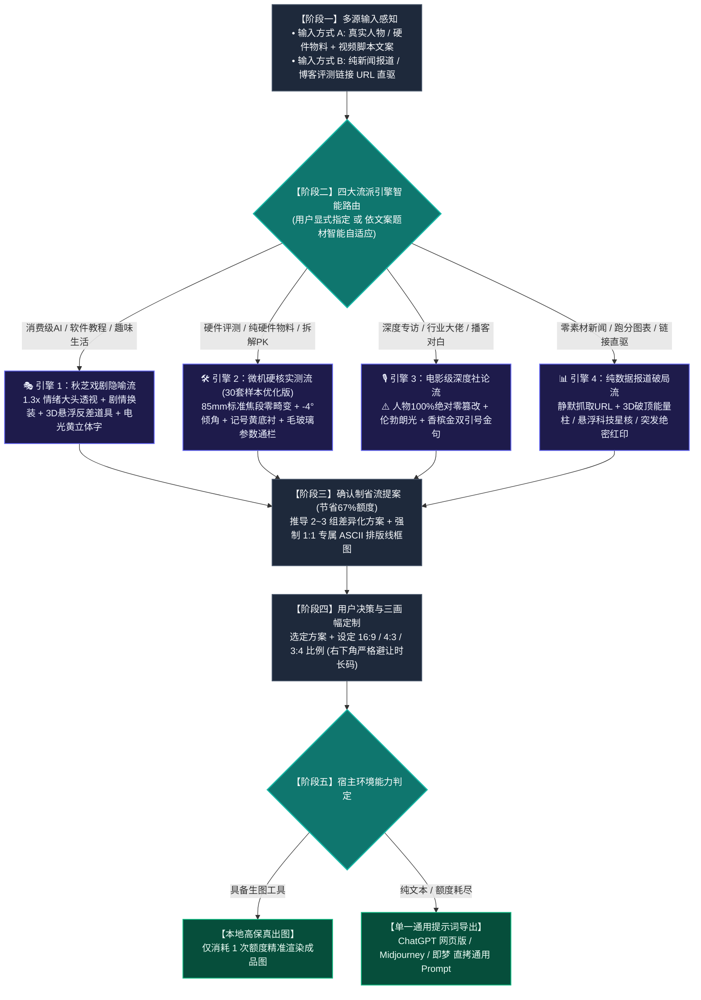

# Viral Video Cover Designer (全平台高点击率视频封面设计引擎 · 多流派工业全集)

本 Skill 旨在解决科技数码及泛知识创作者“做不出吸睛爆款封面、或者风格单一被限制死”的痛点。
核心架构：**构建全流派流量视觉矩阵，由用户自主指定风格或根据内容类型智能自适应匹配；其中【微机硬核实测流】分支深度融合 30 套工程原图实测规范（85mm零畸变、-4°微倾角、明黄划痕底衬、纯黑3D硬实投影、纯硬件无假人、有机印章），同时完整保留并强化【秋芝戏剧隐喻流】、【电影级深度社论流】与【纯数据报道破局流】三大经典流派。**

---

## 🗺️ 一、 全链路执行流程图



---

## 🎨 二、 四大流派核心引擎详解

### 🎭 引擎一：【秋芝戏剧隐喻流】（适用：消费级 AI、工具教程、趣味生活、商业奇闻）
* **视觉哲学**：通过“人设戏剧化反差 + 具象化矛盾道具 + 高张力大头表情”，在信息流中实现毫秒级吸睛。
* **人像摄影与人设**：
  - 100% 锁定用户原摄五官发型，微放大 1.25x~1.35x 呈现极具感染力的大头情绪张力（大张嘴惊呼、挑眉戏谑、抱头绝望）；
  - **剧情角色扮演换装（Cosplay）**：根据文案换装为古代长袍、魔法法师、外科医生、福尔摩斯探长、厨师等鲜明职业装束；
  - 边缘施加 15px 发光光晕与冷暖环境逆光，将人物与深色科技背景干净剥离。
* **3D 拟物化反差道具（核心灵魂）**：
  - 将抽象的痛点或悬念具象化为缩小或放大的反差悬浮物（如：讲降维打击手握雷神之锤，讲内存爆满头顶悬着带血断头闸，讲大模型革命手捧发光科技魔方）。
* **字效与排版**：
  - **4~8 个核心大字**，字高占画面 22%~26%，居中偏上或分列两侧；
  - **秋芝电光黄 `#FED700`**，双层纯黑极粗描边 + 向右下方硬朗延伸 `(+10px, +14px)` 的纯黑 3D 硬实立体投影。

---

### 🛠️ 引擎二：【微机硬核实测流】（30 套真实工程样本深度优化版）
* **适用场景**：CPU/显卡/整机实测、硬件装机、做工用料拆解、桌面工作流、纯硬件宣传物料、双雄旗舰 PK。
* **摄影透视与人像铁律（30 套样本逆向提取）**：
  - **彻底杜绝鱼眼与大头畸变！** 真人出镜严格采用 **85mm 标准单反人像中焦（1:1 真实骨骼比例）**，硬件采用 100mm 工业微距平视/45°俯拍；
  - **真人实操**：双手自然托举硬件、视线聚焦产品、或单手指向核心痛点，神态严谨专业；
  - **纯硬件宣传物料：⚠️ 绝对铁律——严禁凭空生成虚假真人！** 镜头直接聚焦芯片蚀刻纹理、主板电容阵列、CNC 金属切角与散热鳍片，凸显硬核工业质感。
* **微机重工字效与标志色彩**：
  - 经典双行结构，单行 6~8 字，文字整体逆时针 **`-3.0° ~ -5.0°` 动感微倾角**；
  - 字芯纯白 `#FFFFFF` + 纯黑极粗描边 + 向右下方硬朗延伸的 **纯黑 3D 硬实立体投影**；
  - **微机记号笔明黄 `#F8C039` 矩形划痕底衬**，紧密包裹文案中最具吸引力的核心词或型号；
  - 点睛警示红 `#ED1C24`（AMD / 价格痛点）与英特尔/科技蓝 `#00A3E0`。
* **标志性构件与脚本有机衍生**：
  - **半透明毛玻璃通栏（Glassmorphism）**：横向贯穿画面中下部，承载核心跑分、功耗、制程对比；
  - **印章拒绝死板套用，按文案有机定制**：防骗用【别被骗了！】、冷门开源用【宝藏】、首测用【首测】、拆解用【拆！】、深度解析用【做工深扒】；
  - 旗舰对决启用“VS”双雄撞色标。

---

### 🎙️ 引擎三：【电影级深度社论流】（适用：行业专访、创始人对话、圆桌播客、人物对谈）
* **视觉哲学**：以顶级商业杂志封面与纪录片电影质感，赋予视频无可置疑的公信力与思想深度。
* **人像摄影（红线铁律）**：
  - **⚠️ 人物 100% 绝对零篡改（Zero Alteration）！** 严禁换脸、修脸、改表情、改发型、换衣服或卡通化！100% 忠实保留嘉宾原摄眼神、真实皮肤肌理与西装/衬衫质感；
  - **单侧伦勃朗光影（Rembrandt Lighting）**：面部呈现标志性倒三角高光区，背景沉入电影级暗调环境，极具严肃社论深度。
* **字效与构件**：
  - **巨型双引号框定破局金句**：画面核心放置香槟金或纯白开闭双引号 `“ ”`，内部框定嘉宾最具思想冲击力的原话（单行 6~10 字）；
  - **身份背书铭牌**：嘉宾下方附带精致深色磨砂名牌（如“OpenAI 首席架构师”、“前特斯拉硬件工程总监”），确立权威背书；
  - 斜角实底印章选用 **【深度专访】**、**【独家对话】** 或 **【内幕】**。

---

### 📊 引擎四：【纯数据报道破局流】（适用：零图片素材、新闻报道/推特/博客链接 URL 直驱）
* **视觉哲学**：在毫无原始图片的情况下，将抽象的技术参数与跑分数据转化为具备降维打击感的视觉奇观。
* **URL 静默抓取与三维冲突提炼**：
  - 自动调用网络读取工具抓取文章与表格正文；
  - 提炼核心爆点：大事件定性（突发/重磅）、杀手级数字（如成本降 90%、速度翻 5 倍）、被碾压竞品型号。
* **视觉具象化构件**：
  - **3D 破顶发光能量柱 / 跑分阶梯柱状图**：将悬殊的性能差距转化为直冲云霄的发光能量柱，伴随雷电碎裂特效碾压竞品柱；
  - **悬浮科技星核 / 全息光路芯片**：将抽象的算法模型、架构升级或开源代码具象化为发光的悬浮星核；
  - 斜角加盖高饱和度红色 **【突发】**、**【重磅】** 或 **【绝密】** 印章；
  - 底部配置横贯式的黑黄警戒胶带或性能跑分参数栏。

---

## 🚦 三、 确认制省流提案与原子契约

为最大化保护用户的生图 API 配额（避免盲目生图浪费 67% 额度），严格执行以下工作流：
1. **多模态语义解析**：输入实拍图/硬件图 + 脚本文案（或文章 URL 直驱），锁定最佳流派引擎；
2. **推导 2~3 组差异化方案**：每个方案强制绑定**「原子化五要素」**，严禁缺失：
   - `【方案名称】`：流派类别与创意主题；
   - `【主体形态与视角】`：透视规范、服饰道具、手势动线（或硬件微距无假人 / 访谈0篡改）；
   - `【剧情道具与光影】`：核心物体、环境灯光与氛围营造；
   - `【大字报文案与字效】`：具体字数、倾角、主色、底衬与 3D 硬投影；
   - **`【专属 ASCII 结构排版线框图】`（强制 1:1 必填，提几个方案画几个，严禁任何方案省略！）**；
3. **用户确认后单次精准出图**（或导出单一全通用提示词）。

---

## 📐 四、 16:9 / 4:3 / 3:4 三画幅精准重构法则

- **`16:9` (1672×941 横屏 · B站/YouTube)**：左右开阔分栏，**右下角 $[80\%, 100\%] \times [85\%, 100\%]$ 严格留白**，彻底避让播放器时长码；
- **`4:3` (1448×1086 平板/动态卡片)**：横向收拢 10%，大字报字号放大，道具紧贴主体；
- **`3:4` (1086×1448 竖屏海报 · 小红书/抖音/视频号)**：纵向三层重构：顶部标题拆为 3 行垂直堆叠，中部主体居中下，底部横栏贯穿，全屏饱满无黑边。

---

## 🔌 五、 单一全通用提示词导出规范

当宿主 Agent 缺乏生图插件、配额耗尽、或用户需在网页端生成时，输出**唯一全平台通用提示词**（兼容网页端 ChatGPT、Gemini、Midjourney、即梦、可灵）：

```text
请为我生成一张 [画幅比例，如 16:9 / 3:4 / 4:3] 的专业科技数码高点击率视频封面。

【核心流派与主体透视】：
• 采用 [秋芝戏剧隐喻流 / 微机硬核实测流 / 电影深度社论流 / 纯数据报道破局流] 视觉标准；
• 主体参考要求：[若有真实素材则按对应流派严格执行，如微机流采用 85mm 人像或纯硬件微距绝不生造假人；访谈流 100% 保持面容不变；秋芝流 1.3x 情绪大头与剧情换装；无图流生成 3D 跑分破顶柱状图]；
• 主体边缘带有通透的冷暖漫反射轮廓光，将主体与深色科技背景干净剥离。

【排版与重工立体大字】：
• 经典大字报排版：'[核心标题]'；
• 采用 [流派专属字效，如微机黄底衬+纯白黑边-4°倾角 / 秋芝电光黄硬立体]，字芯饱满，带有厚重的纯黑 3D 硬实立体投影；
• [根据文案与流派点缀印章、毛玻璃通栏、金句双引号或警戒胶带]；
• 画面右下角严格留空，避开视频播放器时长码。

【场景与氛围】：
• [契合文案的核心道具与工作室/极客工作台场景]；
• 工业感与公信力十足，景深自然虚化。
```
