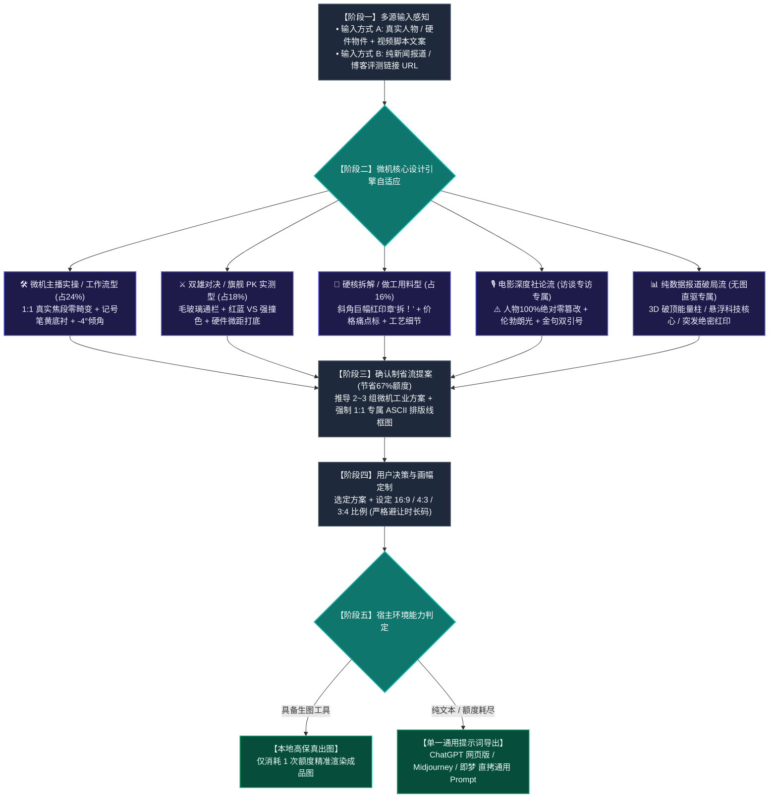

# Viral Video Cover Designer (科技视频封面设计引擎 · 微机实测标准版)

本 Skill 旨在解决科技数码与创作者“封面质感廉价、镜头畸变失真、点击率低下”的痛点。
**坚决剔除夸张大头与鱼眼镜头畸变**，全面采用 **【微型计算机 (Microcomputer)】官方频道 50 期实测封面沉淀的客观数学参数与工业级排版体系**。

---

## 🚦 一、 核心工作流：确认制省流提案流程

为了最大化保护用户的生图 API 配额（避免盲目生图浪费 67% 额度），严格执行以下工作流：



### 🔒 门禁铁律：方案卡片「原子化五要素」强绑定（Atomic Contract）
每个方案（方案 A、方案 B、方案 C...）**必须严格且无一例外包含以下 5 个字段，严禁缺失**：
1. **【方案名称】**：微机范式类别与核心卖点；
2. **【主体形态与视角】**：**严格 50-85mm 标准人像/微距无畸变透视**，1:1 真实骨骼比例，严禁鱼眼大头；
3. **【剧情道具与光影】**：工作室工作台、毛玻璃通栏、微机记号笔底衬、实体产品互动；
4. **【大字报文案与字效】**：**双行排版（占比 84%），单行 6~8 字，逆时针倾斜 -4.0°**，纯白字加黑描边 + 微机黄底衬；
5. **【专属 ASCII 结构排版线框图】**：**必须紧跟在每个方案下方！提几个方案就必须有几个线框图，严禁任何方案省略线框图！**

---

## 📐 二、 【微型计算机】50 期样本提取固定参数（核心标准）

严禁凭空臆造，所有视觉与排版规则均 100% 映射自真实样本库：

| 参数维度 | 微型计算机 50 期客观参数标准 |
| :--- | :--- |
| **镜头透视** | **完全杜绝广角畸变与大头变形**！真人采用 50mm~85mm 标准人像中焦，硬件采用标准微距平视，1:1 自然比例。 |
| **排版结构** | **双行结构（占比 84%）**；单行字数控制在 **6~8 个汉字**。 |
| **字体倾角** | 核心标题呈逆时针倾斜 **`-4.0°`**，赋予工业实测的速度感与工整张力。 |
| **标准色彩池** | • **主文字**：纯白 `#FFFFFF`，外包 **纯黑描边 `#000000`**；<br>• **核心高光/标记者**：**微机记号笔鲜明黄 `#F8C039`**（长方形划痕底衬）；<br>• **警示/AMD 专属色**：高饱和警示红 `#ED1C24`；<br>• **英特尔/评测蓝**：科技群青蓝 `#00A3E0`。 |
| **核心图形资产** | 1. **毛玻璃对决横幅（Glassmorphism）**：半透明磨砂质感；<br>2. **斜角红印章**：如大红实底白字的 **“拆！”**、**“首测”**、**“实战”** 醒目标签；<br>3. **对决双色 VS 标**：左红右蓝对比冲击。 |
| **人像安全法则** | 人物出镜时常驻右侧（或左侧）1/2 区域，做自然手势与硬件互动，绝不遮挡文字与核心参数。 |

---

## 🎭 三、 微机三大核心实测范式

### 1. 范式一：【真人主持 / 桌面实操工作流型】（占 24% · 默认出镜推荐）
* **视觉语言**：主播位于画面一侧（如右侧 1/2），**1:1 真实相机人像质感（50mm 人像镜头，无畸变、无大头）**，双手自然托举或指向硬件/工作台。
* **排版**：双行 `-4.0°` 倾斜字，第一行加 **微机黄 `#F8C039` 笔刷底衬**，第二行纯白黑边。
* **背景**：深色工作室工作台、冷暖漫反射光、清晰的真实硬件或多屏交互。

### 2. 范式二：【双雄对决 / 旗舰 PK 实测型】（占 18%）
* **视觉语言**：硬件芯片/内部结构微距打底，画面正中横贯一条**半透明毛玻璃通栏（Glassmorphism）**。
* **排版**：正中放置鲜明的双色撞色 **“VS”** 大标（左红右蓝），上下分别陈列两款对比产品型号与核心跑分。

### 3. 范式三：【硬核拆解 / 用料做工与性价比型】（占 16%）
* **视觉语言**：纯白/水泥灰极客工作台，硬件外壳与电路板并列平铺。
* **核心点缀**：斜角加盖巨幅红底白字 **“拆！”** 印章，配以黄色标签突出关键痛点（如“499元”、“全量自研”）。

---

## 🎙️ 四、 专项保留流派：深度访谈与纯报道直驱

1. **【电影级深度社论流】（访谈/对白专用）**：
   - **⚠️ 绝对红线铁律（人像 0 篡改）**：严禁换装、修脸、改表情、改动作或卡通化！100% 保留嘉宾原摄真实眼神、西装/衬衫与皮肤质感。
   - 单侧伦勃朗光影 + 巨型香槟金双引号 `“ ”` 框定破局金句 + 身份背书铭牌。
2. **【URL 直驱数据报道流】（无图报道专用）**：
   - 自动静默抓取链接全文与跑分表格；
   - 生成 3D 破顶能量柱、全息科技星核或绝密突发红印章。

---

## 📐 五、 多平台三大画幅自适应矩阵

- **`16:9`（B站横版 / YouTube）**：左右开阔横排，**右下角 $[80\%, 100\%] \times [85\%, 100\%]$ 严格留白**，避让时长码；
- **`4:3`（B站动态 / 专栏 / 平板）**：横向收紧，大字报上下聚拢，道具紧贴主体；
- **`3:4`（小红书 / 视频号 / 抖音）**：经典竖屏海报流，主体位于中下部，顶部黄金区域垂直堆叠超大字报。

---

## 🔌 六、 运行时解耦与【单一通用提示词导出规范】

当宿主 Agent 缺乏生图插件、配额耗尽、或用户需在网页端生成时，输出**唯一全平台通用提示词**（兼容网页端 ChatGPT、Gemini、Midjourney、即梦、可灵）：

```text
请为我生成一张 [画幅比例，如 16:9] 的微型计算机风格专业科技数码视频封面。

【核心构图与摄影要求】：
• 真实单反相机 50mm-85mm 标准镜头质感，完全杜绝广角镜头畸变与大头鱼眼变形；
• 主体人物/硬件保持 1:1 自然真实比例与真实质感，右侧（或一侧）为真实出镜人物，另一侧为核心硬件展示。

【排版与视觉元素】：
• 顶部呈现微机标志性的双行文字排版，字体整体逆时针微倾斜 -4.0 度；
• 第一行核心关键词：带有微机记号笔鲜亮黄色（#F8C039）长方形底衬，黑色粗体字；
• 第二行副标题：纯白色（#FFFFFF）粗黑体，带有深厚纯黑色描边与投影；
• 斜角带有醒目的微机实测红底白字小印章（如：“首测”、“实战”或“拆！”）；
• 画面右下角严格保持留空，避开视频播放器的时间码遮挡。

【背景与光影】：
• 专业数码工作室工作台质感，冷调科技光搭配局部暖色轮廓光，景深柔和虚化，工业感与公信力十足。
```
